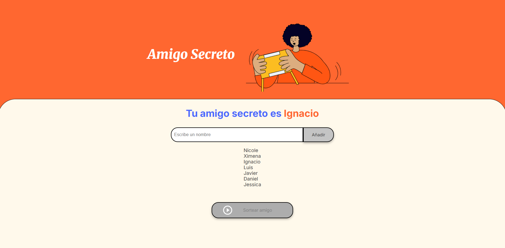

# 🎁 El Juego del Amigo Secreto

¡Bienvenid@ a mi proyecto del **Challenge "El Juego del Amigo Secreto"**!  
Una mini aplicación hecha con 💛 JavaScript puro, HTML y CSS, que te permite crear una lista de amigos y sortear a quién le toca a quién. ¡Ideal para fiestas, celebraciones o simplemente divertirse con amig@s!

---

## ✨ Funcionalidades

- ➕ Agrega nombres de tus amigos a la lista
- 🔁 Evita que se repitan nombres
- 🎲 Sortea al azar el nombre de un "amigo secreto"
- 🎨 Cambia el color de fondo y el estilo al hacer el sorteo
- 🚫 El botón de sorteo se desactiva después de usarlo para evitar múltiples resultados

---

## 🧠 Desafíos resueltos

Durante este challenge trabajé con:

- Manipulación del DOM en JavaScript
- Validaciones de formularios
- Eventos con botones
- Condiciones y lógica básica
- Control de flujo y ramas con Git y GitHub

---

## 🛠 Tecnologías utilizadas

- HTML5
- CSS3
- JavaScript (vanilla JS)

---

## 🚀 ¿Cómo probarlo?

Puedes clonar el repositorio con:

```bash
git clone https://github.com/Zhainy/juego-del-amigo-secreto.git

